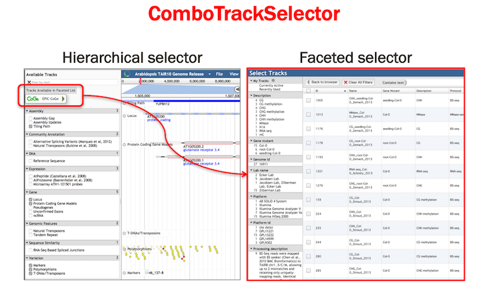

![AIP][1] ComboTrackSelector v1.0
---

### Description

ComboTrackSelector is a JBrowse plugin that enables both the **Hierarchical** and **Faceted** track selectors to co-exist within the scope of JBrowse. The plugin allows for the segregation of the available tracks between the two selectors, which can be customized based on amount of track metadata (e.g. tracks with multiple metadata aspects/facets can be restricted to the **Faceted** selector only).

The following steps explain how the ComboTrackSelect plugin can be installed and configured to work with JBrowse:

+ First, prepare a `trackList.json` file for tracks which should appear only in the **Hierarchical** track selector. An example of such a config file used by the Araport project: [trackList.json](https://github.com/Arabidopsis-Information-Portal/jbrowse-contrib/blob/master/jbrowse-contrib/data/json/arabidopsis/trackList.json)

+ Second, prepare a `trackList2.json` file for tracks which should appear only in the **Faceted** track selector. An example of such a config file as used by the Araport project: [trackList2.json](https://github.com/Arabidopsis-Information-Portal/jbrowse-contrib/blob/master/jbrowse-contrib/data/json/arabidopsis/trackList2.json)

+ Third, prepare a `csv` or `json` formatted file of track metadata, associated with the set of tracks set up to appear in the **Faceted** selector. Examples of such config files as used by the Araport project: [epiccogeMetaData.csv](https://github.com/Arabidopsis-Information-Portal/jbrowse-contrib/blob/master/jbrowse-contrib/data/json/arabidopsis/epiccogeMetaData.csv) or [epiccogeMetaData.json](https://github.com/Arabidopsis-Information-Portal/jbrowse-contrib/blob/master/jbrowse-contrib/data/json/arabidopsis/epiccogeMetaData.json).   
The `trackList2.json` config file should have an appropriately configured `trackMetadata: { }` stanza like so:

		{
			"tracks" : {},
 			"dataRoot" : "arabidopsis",
			"trackMetadata": {
				"sources": [
				{
					"url": "{dataRoot}/epiccogeMetaData.json",
					"type": "json"
				}
			],
			"indexFacets": [
				"Lab Name",
				"Type",
				"Platform",
				:
				:
			]
			}
		}

+ Finally, the plugin can be enabled using **either** __ONE OF__ the following methods (see official [JBrowse documentation](http://gmod.org/wiki/JBrowse_Configuration_Guide#Using_Plugins) on using plugins):
		
`tracks.conf`

		[plugins]
		ComboTrackSelector.location += ./plugins/ComboTrackSelector
		ComboTrackSelector.icon += https://gravatar.com/avatar/f5ae7bbffab5fbd56777fee2720c7ee4.png

`trackList.json`

		"plugins": [
			{
				"name" : "ComboTrackSelector",
				"location" : "./plugins/ComboTrackSelector",
				"icon" : "https://gravatar.com/avatar/f5ae7bbffab5fbd56777fee2720c7ee4.png"
			}
		]

Once enabled and configured correctly, the ComboTrackSelector should appear as seen below:

### Contributors

* [Maria Kim](https://github.com/msarmien) - JCVI
* [Vivek Krishnakumar](https://github.com/vivekkrish) - JCVI

* * *

If you have any questions regarding the usage of this plugin, please write to <mailto:araport@jcvi.org>

[1]: http://bit.ly/aip-logo
